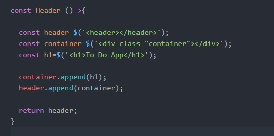
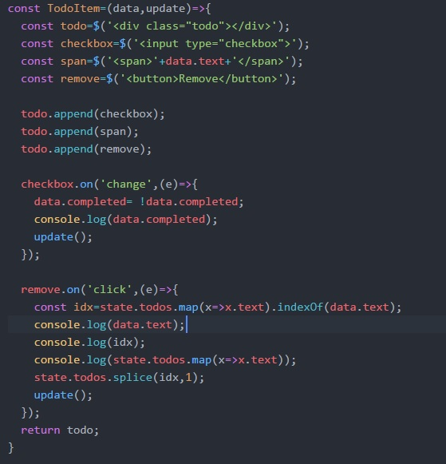
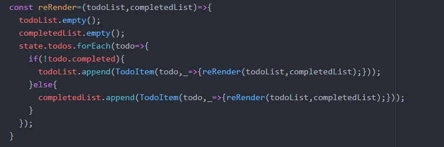
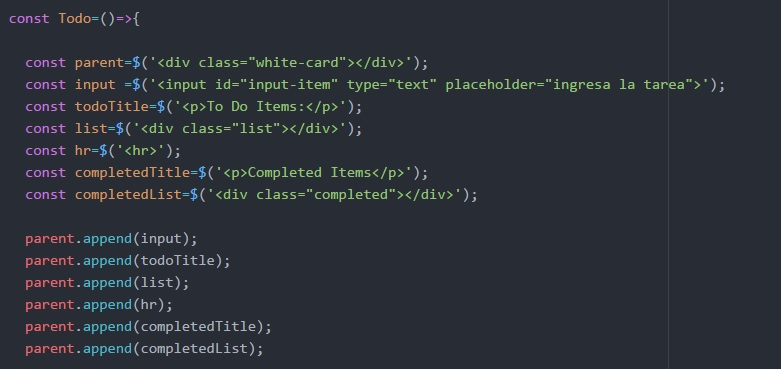
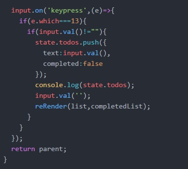
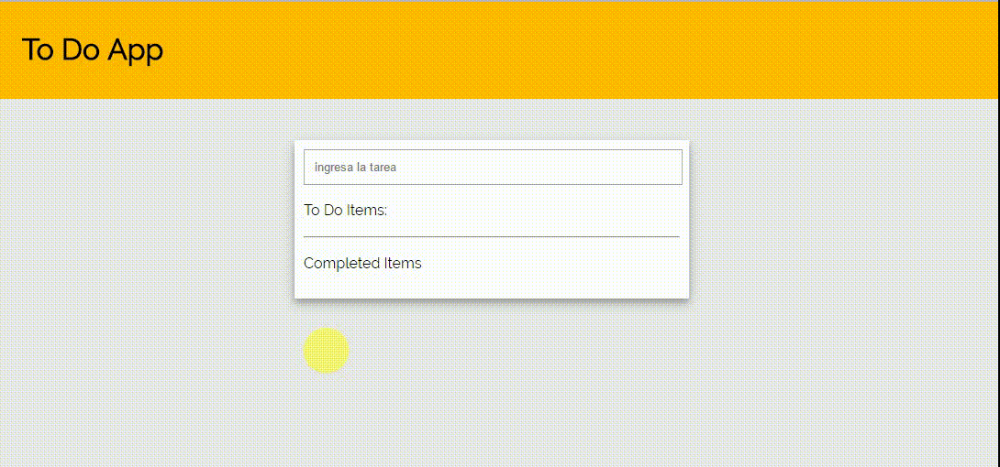

# To do | programación de tareas con estilo React

- El proyecto consiste en realizar un ToDo similar al de Trello.

## Fuentes consultadas:
- jQuery: url(http://api.jquery.com/)

## Componentes

### header.js
Este es un componente que llamamos desde el app.js en el cual se le hará append a un div creado en este archivo para luego enlazarlo con el div.root 

### todo.js
Aquí utilizaremos más funcionalidades, tendremos una función en la cual crearemos los cards, obteniendo el dato del input al dar enter("13"), y al formarse el objeto se pusheará al array todo; también se asigna la propiedad completed como false, la cual cambiará al hacer checked y asi pasará al card de completed list; para remover un item se hace un mapeo y un indexOf pasandole este valor al metodo splice 
 
 
 
 

## Versión Desktop 
Así se ve en la versión desktop:  

## Desarrollado con:

`HTML` `JavaScript` `CSS` `JQUERY`  

##  Créditos* 
* [Stephanie Hiyagon](https://github.com/stephHiyagon)
